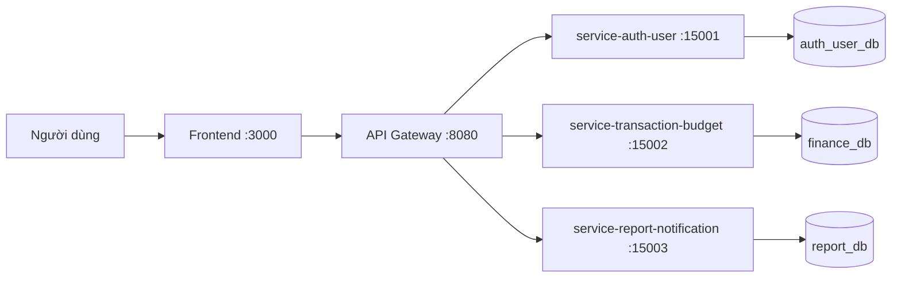

# 🧩 Microservices Assignment Starter Template

Kho chứa này là một **template khởi tạo** cho việc xây dựng hệ thống microservices. Hãy dùng làm nền tảng cho bài tập nhóm của bạn.

> **Không phụ thuộc công nghệ**: Bạn được tự do chọn ngôn ngữ lập trình, framework hoặc cơ sở dữ liệu cho từng service.

---

## 👥 Thành viên nhóm

| Tên | Mã sinh viên | Vai trò | Đóng góp |
|------|------------|------|-------------|
| Đỗ Đức Cảnh | B22DCCN086 | Trưởng nhóm | Service transaction-budget, phân tích & thiết kế |
| Trần Quang Huy | B22DCCN397 | Thành viên | Service report-notification, gateway |
| Trần Quang Huy | B22DCCN398 | Thành viên | Service auth-user, frontend |

---

## 📁 Cấu trúc dự án

```text
BTL HDV/
├── README.md                       # File này — tổng quan dự án
├── .env.example                    # Mẫu biến môi trường
├── docker-compose.yml              # Orchestration đa container
├── Makefile                        # Các lệnh phát triển chung
│
├── docs/                           # 📖 Tài liệu
│   ├── analysis-and-design.md      # Phân tích hệ thống & thiết kế dịch vụ
│   ├── architecture.md             # Kiến trúc hệ thống & sơ đồ
│   ├── asset/                      
│   └── api-specs/                  # Đặc tả OpenAPI 3.0
│       ├── auth-user.yaml
│       ├── transaction-budget.yaml
│       └── report-notification.yaml
│
├── frontend/                       # 🖥️ Ứng dụng frontend
│   ├── Dockerfile
│   ├── readme.md
│   └── src/
│
├── gateway/                        # 🚪 API Gateway / reverse proxy
│   ├── Dockerfile
│   ├── readme.md
│   └── src/
│
├── services/                       # ⚙️ Các microservice backend
│   ├── service-auth-user/
│   │   ├── Dockerfile
│   │   ├── readme.md
│   │   └── src/
│   ├── service-transaction-budget/
│   │   ├── Dockerfile
│   │   ├── readme.md
│   │   └── src/
│   └── service-report-notification/
│       ├── Dockerfile
│       ├── readme.md
│       └── src/
│
├── scripts/                        # 🔧 Script tiện ích
│   └── init.sh
│
├── .github/copilot-instructions.md # Hướng dẫn GitHub Copilot
├── CLAUDE.md                       # Hướng dẫn Claude Code
└── docker/                         # Docker helper và script khởi tạo DB
    └── mysql/
        └── init.sql
```

---

## 🚀 Bắt đầu nhanh

### Yêu cầu trước

- [Docker Desktop](https://docs.docker.com/get-docker/) (Windows/macOS) hoặc Docker Engine + Docker Compose (Linux)
- [Git](https://git-scm.com/)

Kiểm tra phiên bản:

```bash
docker --version
docker compose version
```

### Khởi tạo nhanh

```bash
# 1. Clone repository
git clone <your-repo-url>
cd "mid-project-397398086"

# 2. Khởi tạo dự án
cp .env.example .env
# Hoặc trên PowerShell:
# Copy-Item .env.example .env

# 3. Build và chạy toàn bộ dịch vụ
docker compose up --build

# 4. Kiểm tra dịch vụ đang chạy
curl http://localhost:8080/health   # Gateway
curl http://localhost:15001/health # service-auth-user
curl http://localhost:15002/health # service-transaction-budget
curl http://localhost:15003/health # service-report-notification
```

### Dùng Make (tùy chọn)

```bash
make help      # Hiển thị các lệnh có sẵn
make init      # Khởi tạo dự án
make up        # Build và khởi động tất cả dịch vụ
make down      # Dừng tất cả dịch vụ
make logs      # Xem logs
make clean     # Xóa dữ liệu tạm
```

---

## 🧩 Port các service

- `gateway`: `8080`
- `service-auth-user`: `15001`
- `service-transaction-budget`: `15002`
- `service-report-notification`: `15003`
- `frontend`: `3000`

---

## 📋 Các endpoint chính

### Auth/User
- `POST /api/auth/register`
- `POST /api/auth/login`
- `GET /api/users/me`
- `PUT /api/users/me`
- `PUT /api/users/settings`

### Finance
- `POST /api/finance/transactions`
- `GET /api/finance/transactions?month=YYYY-MM`
- `GET /api/finance/transactions/summary?month=YYYY-MM`
- `GET /api/finance/transactions/chart?month=YYYY-MM`
- `GET /api/finance/budgets/current?month=YYYY-MM`
- `GET /api/finance/budgets`
- `POST /api/finance/budgets`
- `PUT /api/finance/budgets/:id`
- `DELETE /api/finance/budgets/:id`

### Reports & Notifications
- `GET /api/reports/notifications/budget-alerts?month=YYYY-MM`

---

## 🏗️ Kiến trúc hệ thống



- **Frontend** → Giao diện người dùng, chỉ giao tiếp với Gateway
- **Gateway** → Điều hướng yêu cầu đến các backend service phù hợp
- **Services** → Các microservice độc lập, mỗi service chịu trách nhiệm riêng
- **Communication** → REST API qua mạng Docker Compose

> 📖 Tài liệu kiến trúc chi tiết: [`docs/architecture.md`](docs/architecture.md)

---

## 🤖 Phát triển với AI

Kho này có các file hướng dẫn AI để hỗ trợ phát triển.

| Công cụ | File cấu hình |
|------|-------------|
| GitHub Copilot | `.github/copilot-instructions.md` |
| Claude Code | `CLAUDE.md` |

---

## 📋 Quy trình đề xuất

### Giai đoạn 1: Phân tích & Thiết kế
- [ ] Đọc và hiểu template dự án
- [ ] Chọn domain và use case
- [ ] Document phân tích trong [`docs/analysis-and-design.md`](docs/analysis-and-design.md)
- [ ] Thiết kế kiến trúc trong [`docs/architecture.md`](docs/architecture.md)

### Giai đoạn 2: Thiết kế API
- [ ] Định nghĩa API bằng OpenAPI 3.0 trong `docs/api-specs/`
- [ ] Bao gồm tất cả endpoint, request/response schema
- [ ] Review thiết kế API với nhóm

### Giai đoạn 3: Triển khai
- [ ] Chọn stack cho mỗi service
- [ ] Cập nhật Dockerfile cho từng service
- [ ] Triển khai endpoint `GET /health` cho mỗi service
- [ ] Implement business logic và API endpoints
- [ ] Cấu hình routing trong API Gateway
- [ ] Xây dựng UI frontend

### Giai đoạn 4: Kiểm thử & Tài liệu
- [ ] Viết unit và integration tests
- [ ] Kiểm tra `docker compose up --build` chạy được toàn bộ
- [ ] Cập nhật `readme.md` của từng service
- [ ] Cập nhật `README.md` này với thông tin dự án

---

## 🧪 Hướng dẫn phát triển

- **Health checks**: Mỗi service PHẢI expose `GET /health` → `{"status": "ok"}`
- **Môi trường**: Dùng `.env` để cấu hình; không hardcode secrets
- **Mạng**: Dùng tên service Docker Compose trong container, không dùng `localhost`
- **API specs**: Giữ `OpenAPI` đồng bộ với code
- **Git workflow**: Dùng branch, commit có ý nghĩa và commit thường xuyên

---

## 👩‍🏫 Kiểm tra nộp bài

- [ ] `README.md` đã cập nhật thông tin nhóm, mô tả service và hướng dẫn sử dụng
- [ ] Tất cả service khởi động được với `docker compose up --build`
- [ ] Mỗi service có endpoint `GET /health` hoạt động
- [ ] Tài liệu API đầy đủ trong `docs/api-specs/`
- [ ] Kiến trúc ghi lại trong `docs/architecture.md`
- [ ] Phân tích và thiết kế ghi lại trong `docs/analysis-and-design.md`
- [ ] Mỗi service có `readme.md` riêng
- [ ] Code rõ ràng, tổ chức tốt và tuân theo quy ước đã chọn
- [ ] Có tests và tests chạy được

---

## Tác giả

Dựa trên template khởi tạo bởi **Hung Dang**.

Chúc bạn may mắn! 💪🚀
