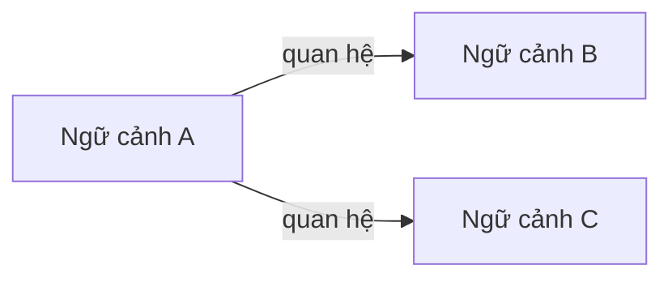
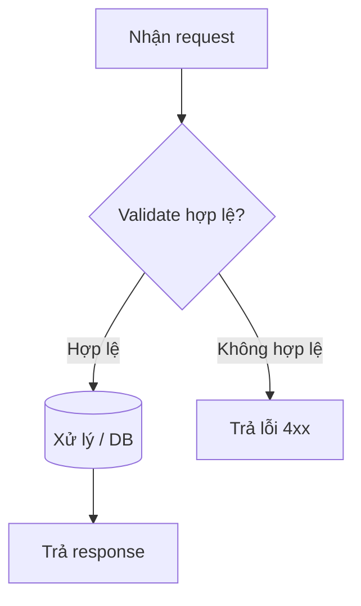

# Phân Tích và Thiết Kế — Cách Tiếp Cận Domain-Driven Design (DDD)

> **Tài liệu thay thế cho**: [`analysis-and-design.md`](analysis-and-design.md) (cách tiếp cận SOA/Erl).  
> Chỉ chọn **một** hướng phân tích, không dùng đồng thời cả hai.

**Tài liệu tham khảo:**
1. *Domain-Driven Design: Tackling Complexity in the Heart of Software* — Eric Evans  
2. *Microservices Patterns: With Examples in Java* — Chris Richardson  
3. *Bài tập — Phát triển phần mềm hướng dịch vụ* — Hùng Đặng

---

## Phần 1 — Khám phá miền nghiệp vụ (Domain Discovery)

### 1.1 Định nghĩa quy trình nghiệp vụ

Mô tả hoặc vẽ sơ đồ quy trình nghiệp vụ tổng quát cần tự động hóa.

- **Domain**: *(điền nội dung)*
- **Business Process**: *(điền nội dung)*
- **Actors**: *(điền nội dung)*
- **Scope**: *(điền nội dung)*

**Sơ đồ quy trình:**

*(Chèn BPMN/flowchart/hình ảnh vào `docs/asset/` và tham chiếu tại đây)*

### 1.2 Hệ thống hiện có

| Tên hệ thống | Loại | Vai trò hiện tại | Cách tích hợp |
|-------------|------|------------------|---------------|
|             |      |                  |               |

> Nếu chưa có hệ thống nào, ghi: *"Chưa có — quy trình hiện đang thực hiện thủ công."*

### 1.3 Yêu cầu phi chức năng

| Yêu cầu | Mô tả |
|--------|------|
| Hiệu năng | |
| Bảo mật | |
| Khả năng mở rộng | |
| Tính sẵn sàng | |

---

## Phần 2 — Strategic DDD

### 2.1 Event Storming — Domain Events

Liệt kê Domain Events theo thứ tự thời gian trong quy trình nghiệp vụ.  
Đặt tên ở thì quá khứ (ví dụ: `OrderPlaced`, `PaymentReceived`).

| # | Domain Event | Được kích hoạt bởi | Mô tả |
|---|--------------|--------------------|------|
|   |              |                    |      |

### 2.2 Commands và Actors

Command nào kích hoạt các Domain Event đó, và ai là người phát lệnh?

| Command | Actor | Kích hoạt Event |
|--------|-------|-----------------|
|        |       |                 |

### 2.3 Aggregates

Nhóm các Command và Event xoay quanh thực thể nghiệp vụ chính (Aggregate).

| Aggregate | Commands | Domain Events | Dữ liệu sở hữu |
|-----------|----------|---------------|----------------|
|           |          |               |                |

### 2.4 Bounded Contexts

Xác định ranh giới giữa các Aggregate thuộc cùng một ngữ cảnh nghiệp vụ.  
Mỗi Bounded Context có thể tương ứng với một service.

| Bounded Context | Aggregates | Trách nhiệm |
|-----------------|------------|-------------|
|                 |            |             |

### 2.5 Context Map

Mô tả mối quan hệ giữa các Bounded Context.

**Các kiểu quan hệ thường dùng:** Upstream/Downstream, Customer/Supplier, Conformist, Anti-Corruption Layer (ACL), Shared Kernel, Open Host Service (OHS), Published Language.

| Upstream | Downstream | Kiểu quan hệ |
|----------|------------|--------------|
|          |            |              |

---

## Phần 3 — Thiết kế hướng dịch vụ

### 3.1 Thiết kế hợp đồng dịch vụ (Uniform Contract)

Đặc tả Service Contract cho từng Bounded Context / service.  
OpenAPI đầy đủ đặt tại:
- [`docs/api-specs/service-a.yaml`](api-specs/service-a.yaml)
- [`docs/api-specs/service-b.yaml`](api-specs/service-b.yaml)

**Service A:**

| Endpoint | Method | Media Type | Mã phản hồi |
|----------|--------|------------|-------------|
|          |        |            |             |

**Service B:**

| Endpoint | Method | Media Type | Mã phản hồi |
|----------|--------|------------|-------------|
|          |        |            |             |

### 3.2 Thiết kế luồng xử lý trong service

Mô tả luồng xử lý nội bộ của từng service.

**Service A:**

**Service B:**

