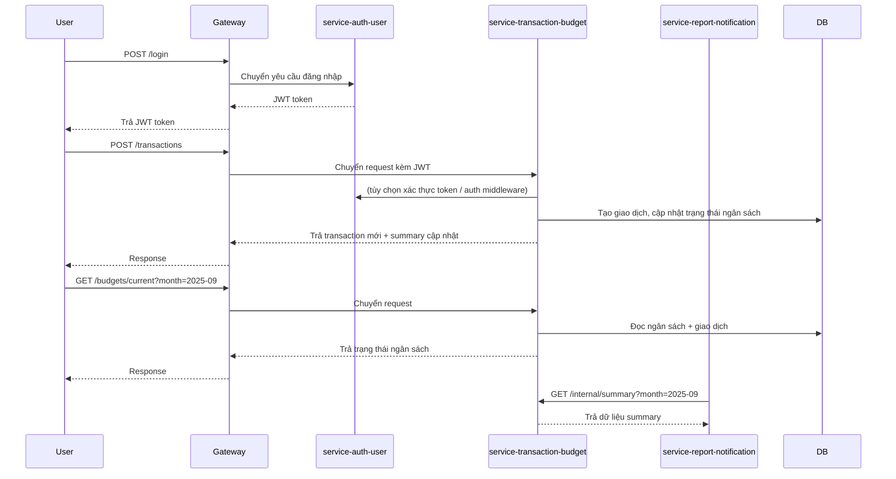

# 📊 Microservices System — Analysis and Design

Tài liệu này mô tả phân tích nghiệp vụ và thiết kế hướng dịch vụ cho một quy trình kinh doanh cụ thể trong hệ thống microservices.

**Tài liệu tham chiếu:**
1. *Service-Oriented Architecture: Analysis and Design for Services and Microservices* — Thomas Erl (2nd Edition)
2. *Microservices Patterns: With Examples in Java* — Chris Richardson
3. *Bài tập — Phát triển phần mềm hướng dịch vụ* — Hung DN (2024)

---

## 1. 🎯 Problem Statement

Mô tả quy trình nghiệp vụ cụ thể mà hệ thống giải quyết:

- **Domain**: Quản lý tài chính cá nhân
- **Problem**: Xây dựng hệ thống microservices để ghi nhận giao dịch thu/chi, quản lý danh mục và ngân sách, đồng thời cung cấp báo cáo tổng quan, biểu đồ và cảnh báo cho người dùng.
- **Users/Actors**: Người dùng cuối (đã xác thực), gateway API, service-auth-user, service-transaction-budget, service-report-notification.
- **Scope**: Trong phạm vi: CRUD giao dịch, CRUD danh mục, CRUD ngân sách, tổng hợp tháng, trạng thái ngân sách và cảnh báo, xác thực JWT, phân tách microservice. Ngoài phạm vi: cổng thanh toán, tích hợp ngân hàng, chuyển đổi đa ngoại tệ.

---

## 2. 🧩 Service-Oriented Analysis

Phân tích quy trình nghiệp vụ để xác định chức năng chính và các microservices tiềm năng.

### 2.1 Business Process Decomposition

| Step | Activity | Actor | Description |
|------|----------|-------|-------------|
| 1 | Người dùng đăng nhập hoặc đăng ký | Người dùng cuối | Xác thực để nhận JWT thông qua service-auth-user |
| 2 | Người dùng nhìn thấy dashboard tài chính | Người dùng cuối | Frontend gọi summary, chart, budget từ service-transaction-budget |
| 3 | Người dùng tạo giao dịch mới | Người dùng cuối | Yêu cầu transaction được gửi đến service-transaction-budget |
| 4 | Service cập nhật dữ liệu và trả về summary | Service | service-transaction-budget tính lại tổng, tác động ngân sách, và cảnh báo |
| 5 | Người dùng quản lý ngân sách/danh mục | Người dùng cuối | CRUD danh mục và ngân sách do service-transaction-budget xử lý |
| 6 | Service báo cáo truy vấn phân tích nội bộ | service-report-notification | Hỗ trợ tổng hợp và tạo cảnh báo qua các endpoint nội bộ |

### 2.2 Entity Identification

| Entity | Attributes | Owned By |
|--------|------------|----------|
| User | id, fullName, email, passwordHash, createdAt, updatedAt | service-auth-user |
| UserSettings | userId, defaultCurrency | service-auth-user |
| Transaction | id, userId, type, amount, categoryId, note, transactionDate, createdAt, updatedAt | service-transaction-budget |
| Category | id, userId/systemDefault, name, type | service-transaction-budget |
| Budget | id, userId, month, categoryId, limitAmount, alertThreshold, createdAt, updatedAt | service-transaction-budget |
| Notification | id, userId, type, title, message, status, metadata, createdAt | service-report-notification |

### 2.3 Service Candidate Identification

Xác định các service dựa trên:
- Phân tách năng lực nghiệp vụ (business capability)
- Bối cảnh giới hạn theo Domain-Driven Design
- Ranh giới sở hữu dữ liệu

- **service-auth-user**: Xác thực người dùng, cấp JWT, quản lý profile và cài đặt.
- **service-transaction-budget**: Quản lý giao dịch, danh mục, ngân sách, tổng hợp hàng tháng, cảnh báo ngân sách.
- **service-report-notification**: Tạo báo cáo, phân tích và gửi thông báo.
- **gateway**: Định tuyến API, tổng hợp, chuyển tiếp xác thực.

---

## 3. 🔄 Service-Oriented Design

### 3.1 Service Inventory

| Service | Responsibility | Type |
|---------|----------------|------|
| service-auth-user | Xác thực và quản lý thông tin người dùng | Entity / Task |
| service-transaction-budget | Quản lý giao dịch, danh mục, ngân sách, tổng hợp, phân tích | Entity / Task |
| service-report-notification | Tạo báo cáo và cảnh báo | Task |
| gateway | Định tuyến API và tổng hợp | Utility |

### 3.2 Service Capabilities (Interface Design)

**service-auth-user:**
| Capability | Method | Endpoint | Input | Output |
|------------|--------|----------|-------|--------|
| Đăng ký người dùng | POST | `/register` | email, password, fullName | object user + JWT |
| Đăng nhập | POST | `/login` | email, password | JWT token |
| Lấy profile | GET | `/me` | bearer token | user profile |

**service-transaction-budget:**
| Capability | Method | Endpoint | Input | Output |
|------------|--------|----------|-------|--------|
| Health check | GET | `/health` | none | status ok |
| Liệt kê giao dịch | GET | `/transactions` | month, type, categoryId | Transaction[] |
| Tạo giao dịch | POST | `/transactions` | transaction body | Transaction |
| Lấy giao dịch | GET | `/transactions/{id}` | id | Transaction |
| Cập nhật giao dịch | PUT | `/transactions/{id}` | id, transaction body | Transaction |
| Xóa giao dịch | DELETE | `/transactions/{id}` | id | none |
| Liệt kê danh mục | GET | `/categories` | none | Category[] |
| Tạo danh mục | POST | `/categories` | category body | Category |
| Liệt kê ngân sách | GET | `/budgets` | none | Budget[] |
| Tạo ngân sách | POST | `/budgets` | budget body | Budget |
| Lấy trạng thái ngân sách hiện tại | GET | `/budgets/current` | month | BudgetStatus |
| Cập nhật ngân sách | PUT | `/budgets/{id}` | id, budget body | Budget |
| Xóa ngân sách | DELETE | `/budgets/{id}` | id | none |
| Tổng hợp nội bộ | GET | `/internal/summary` | month | Summary |
| Phân tích theo danh mục nội bộ | GET | `/internal/category-breakdown` | month | Breakdown |
| Phân tích tháng nội bộ | GET | `/internal/analytics/monthly` | month | Analytics |
| Cảnh báo nội bộ | GET | `/internal/alerts` | month | Alerts |

**service-report-notification:**
| Capability | Method | Endpoint | Input | Output |
|------------|--------|----------|-------|--------|
| Lấy summary báo cáo | GET | `/reports/summary` | month | report payload |
| Gửi thông báo | POST | `/notifications` | notification payload | status |

### 3.3 Service Interactions

Mô tả cách tương tác giữa các service:



### 3.4 Data Ownership & Boundaries

| Data Entity | Owner Service | Access Pattern |
|-------------|---------------|----------------|
| User | service-auth-user | CRUD qua REST API |
| Transaction | service-transaction-budget | CRUD qua REST API |
| Category | service-transaction-budget | CRUD qua REST API |
| Budget | service-transaction-budget | CRUD qua REST API |
| Notification | service-report-notification | CRUD / internal API |

---

## 4. 📋 API Specifications

Định nghĩa API đầy đủ nằm ở:
- `docs/api-specs/auth-user.yaml`
- `docs/api-specs/transaction-budget.yaml`
- `docs/api-specs/report-notification.yaml`

---

## 5. 🗄️ Data Model

Mô tả mô hình dữ liệu cho từng service:

### service-auth-user — Data Model
```
┌─────────────────────────┐
│ User                    │
├─────────────────────────┤
│ id                      │
│ fullName                │
│ email                   │
│ passwordHash            │
│ createdAt               │
│ updatedAt               │
└─────────────────────────┘
```

### service-transaction-budget — Data Model
```
┌─────────────────────────┐
│ Transaction             │
├─────────────────────────┤
│ id                      │
│ userId                  │
│ type                    │
│ amount                  │
│ categoryId              │
│ note                    │
│ transactionDate         │
│ createdAt               │
│ updatedAt               │
└─────────────────────────┘
```

```
┌─────────────────────────┐
│ Category                │
├─────────────────────────┤
│ id                      │
│ userId                  │
│ systemDefault           │
│ name                    │
│ type                    │
└─────────────────────────┘
```

```
┌─────────────────────────┐
│ Budget                  │
├─────────────────────────┤
│ id                      │
│ userId                  │
│ month                   │
│ categoryId              │
│ limitAmount             │
│ alertThreshold          │
│ createdAt               │
│ updatedAt               │
└─────────────────────────┘
```

### service-report-notification — Data Model
```
┌─────────────────────────┐
│ Notification            │
├─────────────────────────┤
│ id                      │
│ userId                  │
│ type                    │
│ title                   │
│ message                 │
│ status                  │
│ metadata                │
│ createdAt               │
└─────────────────────────┘
```

---

## 6. ❗ Non-Functional Requirements

| Requirement | Description |
|-------------|-------------|
| Performance | Thời gian phản hồi API nhanh, ưu tiên < 200ms trong môi trường local |
| Scalability | Hỗ trợ scale độc lập cho service-transaction-budget và service-report-notification |
| Availability | Có health check `/health` và khả năng phục hồi khi khởi động lại |
| Security | Xác thực JWT, validate input, không để secrets cứng trong mã nguồn |
| Maintainability | Tách rõ ràng controller/service/repository để dễ bảo trì |
| Availability | Health checks on `/health` and service restart resilience |
| Security | JWT auth, input validation, no secrets hard-coded, service-to-service auth boundaries |
| Maintainability | Clear service boundaries, separate controllers/services/repositories |
