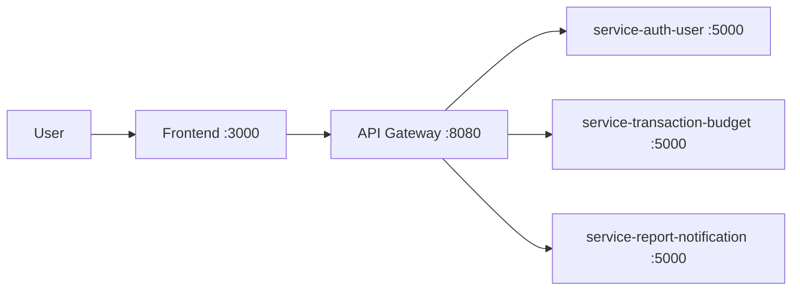

# Kiến Trúc Hệ Thống

## 1. Kiến trúc tổng thể
Hệ thống theo luồng:
**Frontend -> API Gateway -> Microservices**

- Frontend chỉ gọi gateway, không gọi trực tiếp từng service.
- Gateway route theo prefix API.
- Các service giao tiếp nội bộ qua Docker DNS (tên service).

## 2. Vai trò từng service
- **service-auth-user**
  - Đăng ký/đăng nhập
  - Cấp JWT
  - Quản lý profile và user settings
- **service-transaction-budget**
  - Quản lý transaction/category/budget
  - Tính tổng thu, tổng chi, số dư
  - Cung cấp endpoint nội bộ cho report service
- **service-report-notification**
  - Tổng hợp dữ liệu báo cáo dashboard
  - Tính category breakdown, cashflow
  - Sinh và trả notification cảnh báo ngân sách

## 3. Giao tiếp giữa các service
- Gateway -> auth-user: `/api/auth/*`
- Gateway -> transaction-budget: `/api/finance/*`
- Gateway -> report-notification: `/api/reports/*`
- report-notification -> transaction-budget (HTTP nội bộ):
  - `GET /internal/summary?month=YYYY-MM`
  - `GET /internal/category-breakdown?month=YYYY-MM`
  - `GET /internal/alerts?month=YYYY-MM`
  - `GET /transactions?month=YYYY-MM`

## 4. Vì sao chọn API Gateway
- Một điểm vào duy nhất cho frontend.
- Dễ quản lý route, CORS, auth header và xử lý lỗi upstream tập trung.
- Dễ thay đổi/mở rộng backend mà frontend ít bị ảnh hưởng.

## 5. Vì sao chọn Database per Service
Dù project hiện tại dùng in-memory để demo, thiết kế vẫn theo hướng **DB per Service**:
- Mỗi service sở hữu dữ liệu và logic riêng.
- Giảm phụ thuộc trực tiếp giữa các service.
- Dễ scale/đổi công nghệ DB cho từng service sau này.

## 6. Triển khai
- Đóng gói bằng Docker
- Chạy bằng Docker Compose
- Lệnh: `docker compose up --build`
