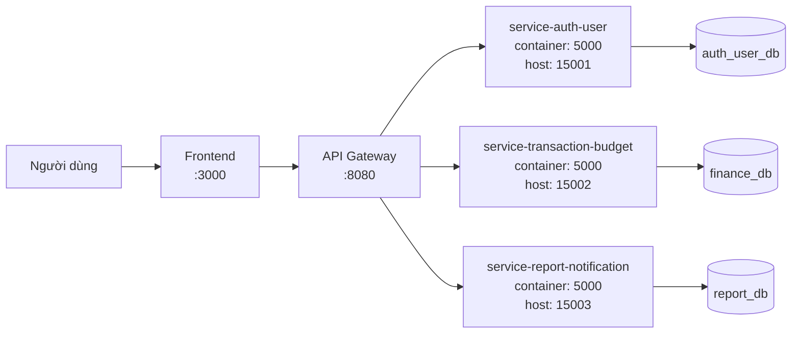
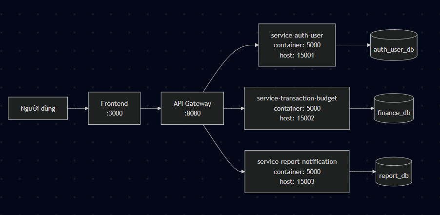

# 🏗️ Kiến Trúc Hệ Thống

## 1. Tổng quan

Hệ thống microservices này cung cấp nền tảng quản lý tài chính cá nhân, cho phép người dùng theo dõi giao dịch, quản lý ngân sách và nhận báo cáo/thông báo.

- Vấn đề nó giải quyết: Giúp người dùng quản lý tài chính cá nhân một cách hiệu quả, theo dõi thu chi, đặt ngân sách và nhận cảnh báo khi vượt quá giới hạn.
- Đối tượng người dùng mục tiêu: Người dùng cá nhân muốn quản lý tài chính hàng ngày.
- Các thuộc tính chất lượng chính: Khả năng mở rộng (scale từng service độc lập), độ tin cậy (fault tolerance với circuit breaker), bảo mật (JWT authentication), hiệu suất (caching và tối ưu DB).

## 2. Phong cách kiến trúc

Mô tả các mẫu và phong cách kiến trúc được sử dụng:

- [x] Microservices
- [x] API Gateway pattern
- [ ] Event-driven / Message queue
- [ ] CQRS / Event Sourcing
- [x] Database per service
- [ ] Saga pattern
- [ ] Khác: ___

## 3. Thành phần hệ thống

| Thành phần    | Trách nhiệm                              | Ngăn xếp công nghệ | Cổng  |
|---------------|------------------------------------------|-------------------|-------|
| **Frontend**  | Giao diện người dùng                    | React, Vite       | 3000  |
| **Gateway**   | Định tuyến API, xác thực, giới hạn tốc độ | Node.js, Express  | 8080  |
| **service-auth-user** | Xác thực người dùng, quản lý hồ sơ     | Node.js, Express, MySQL | 5000  |
| **service-transaction-budget** | Quản lý giao dịch, danh mục, ngân sách | Node.js, Express, MySQL | 5000  |
| **service-report-notification** | Báo cáo và thông báo                   | Node.js, Express, MySQL | 5000  |
| **Database**  | Lưu trữ bền vững                        | MySQL             | 3306  |

## 4. Mẫu giao tiếp

Mô tả cách các dịch vụ giao tiếp:

- **Đồng bộ**: REST API giữa các dịch vụ
- **Bất đồng bộ**: Không sử dụng (có thể mở rộng sau với message queue)
- **Khám phá dịch vụ**: Docker Compose DNS (sử dụng tên service)

### Ma trận giao tiếp giữa các dịch vụ

| Từ → Đến     | service-auth-user | service-transaction-budget | service-report-notification | Gateway | Database |
|---------------|-------------------|----------------------------|-----------------------------|---------|----------|
| **Frontend**  |                   |                            |                             | REST    |          |
| **Gateway**   | REST              | REST                       | REST                        |         |          |
| **service-auth-user** |                   |                            |                             |         | SQL      |
| **service-transaction-budget** |                   |                            | REST                        |         | SQL      |
| **service-report-notification** |                   |                            |                             |         | SQL      |

## 5. Luồng dữ liệu

Mô tả luồng yêu cầu điển hình:

```
Người dùng → Frontend → Gateway → service-auth-user (đăng nhập/xác thực)
                              → service-transaction-budget (quản lý giao dịch/ngân sách)
                              → service-report-notification (lấy báo cáo/thông báo)
```

## 6. Sơ đồ kiến trúc

> Đặt sơ đồ của bạn trong `docs/asset/` và tham chiếu ở đây.
>
> Công cụ khuyến nghị: draw.io, Mermaid, PlantUML, Excalidraw





## 7. Triển khai

- Tất cả dịch vụ được đóng gói bằng Docker
- Điều phối qua Docker Compose
- Lệnh đơn: `docker compose up --build`

## 8. Khả năng mở rộng & Dung sai lỗi

- Cách các dịch vụ riêng lẻ có thể mở rộng độc lập? Mỗi service chạy trong container riêng, có thể scale bằng cách tăng số instance qua Docker Compose hoặc Kubernetes.
- Điều gì xảy ra khi một dịch vụ ngừng hoạt động? Gateway có thể trả lỗi 502/503, frontend hiển thị thông báo lỗi. Các service khác vẫn hoạt động độc lập.
- Có cơ chế thử lại hoặc cầu dao không? Hiện tại chưa triển khai, nhưng có thể thêm retry logic và circuit breaker trong Gateway.
- Cách duy trì tính nhất quán dữ liệu giữa các dịch vụ? Sử dụng database per service, giao tiếp đồng bộ qua REST API. Đối với các thao tác phức tạp, có thể cần Saga pattern sau này.
